<h2 style="text-align: center; color: #0074D9;">
  
</h2>

I'm a passionate developer, coder, and technology geek with a knack for hacking into challenges and solving them one line of code at a time. 🚀

 
  

## About Me

- 🔭 I'm currently working on https://vivek.aryanvbw.live
- 🌱 I'm constantly learning and exploring new technologies and tools.
- 📫 How to reach me: [vivek.AryanVBW](mailto:vivek.aryanvbw@gmail.com)
- 😄 Pronouns: he

##Tech Stack

Here are some of the technologies and tools I frequently work with:

- 💻 Programming Languages:e.g., Python, JavaScript, Java
- 🛠️ Frameworks & Libraries: e.g., React, Node.js, Django
- 🌐 Web Technologies:e.g., HTML5, CSS3, GraphQL
- 📦 Databases: e.g., MongoDB, MySQL, PostgreSQL
- 🖥️ DevOps & Tools:e.g., Docker, Git, AWS
- 🔒 Cybersecurity & Ethical Hacking:Nmap (Network Mapper),Metasploit,Wireshark,Burp Suite,Aircrack-ng,Nikto,WifiTe etc.

## Projects

Here are a few projects I'm proud of:

- [ANDRO](https://github.com/AryanVBW/ANDRO): A cloud based remote android managment suite.
- [LinuxDroid](https://github.com/AryanVBW/LinuxDroid): Linux on Android e.g Kali nethuter,Ubatu GUI/CLI,kali GUI,Arch Linux CLI.
- [WifiJAM](https://github.com/AryanVBW/WIFIjam):Python WiFi Deauthentication Script.

## Connect with Me

Let's connect and collaborate on exciting projects:

- 📧 Email: [my@gmail.com](mailto:vivek.aryanvbw@gmail.com)
- 📧 Business Email: [Business.Mail](mailto:admin@AryanVBW.live)
- 💼 LinkedIn: [@vivekwagadare](https://www.linkedin.com/in/vivek-wagadare-b677a9216)
- 🐦 Twitter: [@vivekwagadare](https://x.com/vivekwagadare?t=nuIH3LUbo8o2o1Rjxot-hA&s=09)
- 🌐 Web store: [TEch-Shop](https://view.aryanvbw.live)
-  Instagram: [@vivek](https://instagram.com/vivekbw?igshid=NGVhN2U2NjQ0Yg==)
-  Instagram: [@Aryan_Technologies](https://instagram.com/aryan_technolog1es?igshid=MzMyNGUyNmU2YQ==)

Feel free to reach out, and let's build something amazing together! 🚀

 <!-- 

    
    

    

 
  Visitor count 
  

-->
