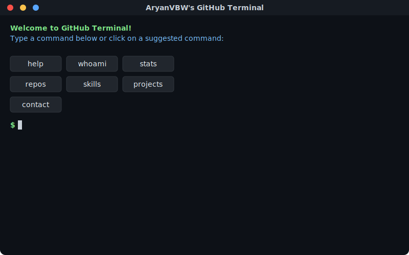

# 

I'm a passionate developer, cybersecurity enthusiast, and technology explorer with a knack for hacking into challenges and solving them one line of code at a time. 🚀

  

<!-- GitHub Terminal - Interactive SVG Profile -->

  

<!-- 

 -->

  

## 💻 Interactive Terminal

The animated terminal above showcases my GitHub profile in a unique way! It's designed to simulate a real terminal experience with:

### 🚀 Available Commands

| Command | Description |
|---------|-------------|
| `help` | Display available commands |
| `whoami` | Learn about me |
| `stats` | View my GitHub statistics |
| `skills` | See my technical skills |
| `repos` | List my top repositories |
| `projects` | View my featured projects |
| `contact` | Get my contact information |
| `clear` | Clear the terminal screen |
| `date` | Display current date and time |
| `echo [text]` | Echo back your text |

### 🌟 Terminal Features

- **Auto-typing Demo**: Watch as commands are automatically typed and executed
- **Animated Output**: Smooth animations when displaying command results
- **Modern UI**: macOS-style terminal design with window controls
- **Real-time Stats**: Updated every 6 hours with my latest GitHub activity

💡 How it works

This terminal is built using SVG with embedded JavaScript animations. It fetches real-time data from the GitHub API and presents it in an interactive terminal format. The SVG is generated using a Python script that runs via GitHub Actions every 6 hours.

## 👨‍💻 About Me

- 🔭 I'm currently working on https://vivek.aryanvbw.live
- 🌱 I'm constantly learning and exploring new technologies and tools
- 🚀 I love building innovative solutions to complex problems
- 📫 How to reach me: [vivek.AryanVBW](mailto:vivek.aryanvbw@gmail.com)
- 😄 Pronouns: he

## 🛠️ Tech Stack

Here are some of the technologies and tools I frequently work with:

- 💻 **Programming Languages**: Python, JavaScript, Java
- 🌐 **Web Technologies**: HTML5, CSS3, GraphQL
- 🛠️ **Frameworks & Libraries**: React, Node.js, Django
- 📦 **Databases**: MongoDB, MySQL, PostgreSQL
- 🖥️ **DevOps & Tools**: Docker, Git, AWS
- 🔒 **Cybersecurity & Ethical Hacking**: Nmap, Metasploit, Wireshark, Burp Suite, Aircrack-ng, Nikto, WifiTe

## 🚀 Featured Projects

Here are a few projects I'm proud of:

- [**ANDRO**](https://github.com/AryanVBW/ANDRO): A cloud-based remote Android management suite
- [**LinuxDroid**](https://github.com/AryanVBW/LinuxDroid): Linux on Android (Kali NetHunter, Ubuntu GUI/CLI, Kali GUI, Arch Linux CLI)
- [**WifiJAM**](https://github.com/AryanVBW/WIFIjam): Python WiFi Deauthentication Script

Type `projects` in the terminal above for more details!

## 🔗 Connect with Me

Let's connect and collaborate on exciting projects:

- 📧 Email: [vivek.aryanvbw@gmail.com](mailto:vivek.aryanvbw@gmail.com)
- 📧 Business Email: [admin@AryanVBW.live](mailto:admin@AryanVBW.live)
- 💼 LinkedIn: [@vivekwagadare](https://www.linkedin.com/in/vivek-wagadare-b677a9216)
- 🐦 Twitter: [@vivekwagadare](https://x.com/vivekwagadare?t=nuIH3LUbo8o2o1Rjxot-hA&s=09)
- 🌐 Web store: [Tech-Shop](https://view.aryanvbw.live)
-  Instagram: [@vivekbw](https://instagram.com/vivekbw?igshid=NGVhN2U2NjQ0Yg==)
-  Instagram: [@Aryan_Technologies](https://instagram.com/aryan_technolog1es?igshid=MzMyNGUyNmU2YQ==)

Type `contact` in the terminal above to see my contact information!

Feel free to reach out, and let's build something amazing together! 🚀

<!-- 

 <!-- 

    
    

    

 
  Visitor count 
  

-->
